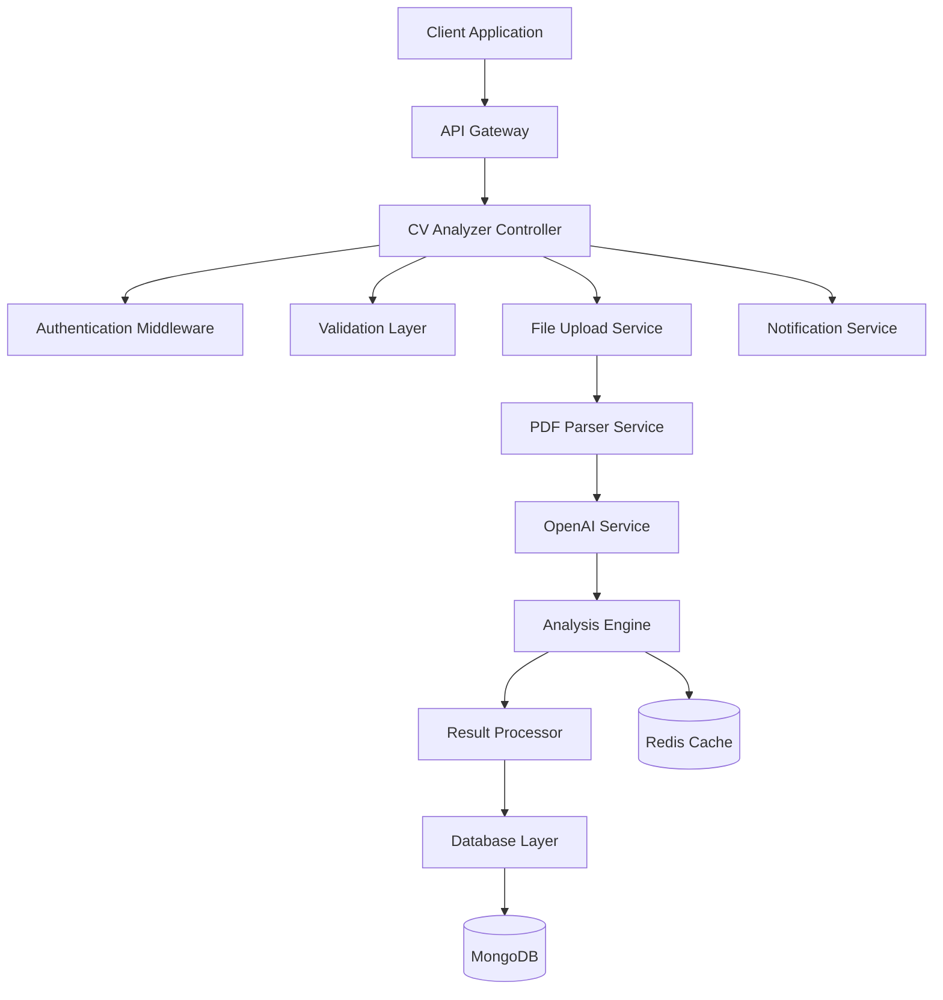

# CV Analyzer Architecture

## System Architecture Overview

The CV Analyzer module follows a microservice-oriented architecture pattern that integrates seamlessly with the existing job portal infrastructure.

## High-Level Architecture



## Component Architecture

### 1. Controller Layer
- **CVAnalyzerController**: Main orchestrator for CV analysis operations
- **Responsibilities**: Request handling, response formatting, error management
- **Pattern**: RESTful API following existing project conventions

### 2. Service Layer
```javascript
// Service architecture pattern
class CVAnalyzerService {
  constructor(dependencies) {
    this.pdfParser = dependencies.pdfParser;
    this.openaiService = dependencies.openaiService;
    this.analysisEngine = dependencies.analysisEngine;
    this.cacheService = dependencies.cacheService;
  }
}
```

### 3. Data Access Layer
- **Models**: CVAnalysis, AnalysisResult, JobMarketData
- **Repositories**: Abstraction layer for database operations
- **Migrations**: Schema versioning and updates

## Design Patterns

### 1. Factory Pattern
```javascript
// Service factory for dependency injection
class ServiceFactory {
  static createCVAnalyzer() {
    return new CVAnalyzerService({
      pdfParser: new PDFParserService(),
      openaiService: new OpenAIService(),
      analysisEngine: new AnalysisEngine(),
      cacheService: new CacheService()
    });
  }
}
```

### 2. Strategy Pattern
```javascript
// Analysis strategy based on experience level
class AnalysisStrategyFactory {
  static getStrategy(experienceLevel) {
    switch (experienceLevel) {
      case 'entry': return new EntryLevelStrategy();
      case 'mid': return new MidLevelStrategy();
      case 'senior': return new SeniorLevelStrategy();
      case 'executive': return new ExecutiveStrategy();
    }
  }
}
```

### 3. Observer Pattern
```javascript
// Progress tracking and notifications
class AnalysisProgressTracker {
  constructor() {
    this.observers = [];
  }
  
  subscribe(observer) {
    this.observers.push(observer);
  }
  
  notify(progress) {
    this.observers.forEach(observer => observer.update(progress));
  }
}
```

## Data Flow Architecture

### 1. Upload & Processing Flow
```
User Upload → Validation → File Storage → PDF Parsing → 
Text Extraction → Content Analysis → OpenAI Processing → 
Result Generation → Database Storage → Response
```

### 2. Analysis Pipeline
```javascript
// Async processing pipeline
const analysisPipeline = [
  'validateInput',
  'parseCV',
  'extractSections',
  'analyzeContent',
  'generateRecommendations',
  'calculateScores',
  'formatResults',
  'storeResults'
];
```

## Database Architecture

### Entity Relationship Diagram
```
┌─────────────────┐       ┌─────────────────┐
│      User       │       │   CVAnalysis    │
│                 │───────│                 │
│ _id             │   1:N │ _id             │
│ email           │       │ userId          │
│ fullName        │       │ originalCV      │
└─────────────────┘       │ extractedText   │
                          │ overallScore    │
                          │ analysisData    │
                          │ createdAt       │
                          └─────────────────┘
                                    │
                                    │ 1:N
                          ┌─────────────────┐
                          │ AnalysisResult  │
                          │                 │
                          │ _id             │
                          │ analysisId      │
                          │ section         │
                          │ score           │
                          │ recommendations │
                          │ insights        │
                          └─────────────────┘
```

### Schema Design Principles
- **Normalization**: Separate concerns into logical entities
- **Indexing**: Optimized for query patterns
- **Versioning**: Schema evolution support
- **Relationships**: Proper foreign key constraints

## Caching Strategy

### Multi-Level Caching
```javascript
// L1: In-Memory Cache (Node.js process)
const memoryCache = new Map();

// L2: Redis Cache (Shared across instances)
const redisCache = new Redis(process.env.REDIS_URL);

// L3: Database Query Cache
const queryCache = new QueryCache();
```

### Cache Invalidation
- **Time-based**: TTL for temporary data
- **Event-based**: Invalidate on data updates
- **Version-based**: Cache versioning for consistency

## Security Architecture

### Authentication & Authorization
```javascript
// Multi-layer security
const securityMiddleware = [
  authenticateUser,        // JWT validation
  validateCVAnalysisAccess, // Resource-level access
  rateLimitMiddleware,     // Rate limiting
  inputSanitization       // XSS protection
];
```

### Data Protection
- **Encryption**: Sensitive data at rest
- **Sanitization**: User input cleaning
- **Validation**: Comprehensive input validation
- **Audit Trail**: Security event logging

## Scalability Considerations

### Horizontal Scaling
- **Stateless Services**: No server-side state
- **Load Balancing**: Distribute requests across instances
- **Database Sharding**: Partition data for performance
- **Microservice Ready**: Deployable as separate service

### Performance Optimization
- **Connection Pooling**: Database connection management
- **Lazy Loading**: On-demand resource loading
- **Batch Processing**: Group operations for efficiency
- **Async Operations**: Non-blocking I/O operations

## Error Handling Architecture

### Error Classification
```javascript
// Hierarchical error handling
class CVAnalyzerError extends Error {
  constructor(type, message, details) {
    super(message);
    this.type = type;
    this.details = details;
  }
}

class ValidationError extends CVAnalyzerError {}
class ProcessingError extends CVAnalyzerError {}
class OpenAIError extends CVAnalyzerError {}
```

### Recovery Strategies
- **Retry Logic**: Exponential backoff for transient failures
- **Circuit Breaker**: Prevent cascade failures
- **Fallback**: Graceful degradation
- **Dead Letter Queue**: Failed operation handling

## Monitoring & Observability

### Metrics Collection
- **Business Metrics**: Analysis success rate, user engagement
- **Technical Metrics**: Response time, error rate, throughput
- **Infrastructure Metrics**: CPU, memory, disk usage

### Logging Strategy
```javascript
// Structured logging
const logger = {
  info: (message, context) => log('info', message, context),
  error: (message, error, context) => log('error', message, { error, ...context }),
  performance: (operation, duration, context) => log('performance', operation, { duration, ...context })
};
```

## Deployment Architecture

### Container Strategy
```dockerfile
# Multi-stage build for optimization
FROM node:18-alpine AS builder
WORKDIR /app
COPY package*.json ./
RUN npm ci --only=production

FROM node:18-alpine AS runtime
WORKDIR /app
COPY --from=builder /app/node_modules ./node_modules
COPY . .
EXPOSE 3000
CMD ["node", "index.js"]
```

### Environment Configuration
- **Development**: Local MongoDB, file storage
- **Staging**: Managed database, cloud storage
- **Production**: High availability, distributed setup

## Integration Points

### Existing System Integration
- **User Management**: Leverages existing authentication
- **File Upload**: Extends existing multer configuration
- **Database**: Uses existing MongoDB connection
- **Notifications**: Integrates with existing notification system

### External Service Integration
- **OpenAI API**: Primary AI processing service
- **Redis**: Caching and session management
- **Cloud Storage**: File persistence (optional)
- **Monitoring**: APM and logging services

This architecture ensures the CV Analyzer module integrates seamlessly with your existing job portal while maintaining high performance, scalability, and security standards.
